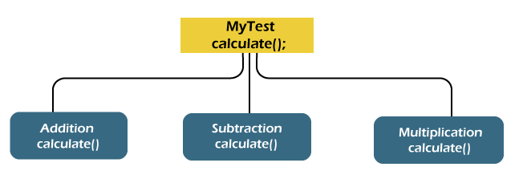
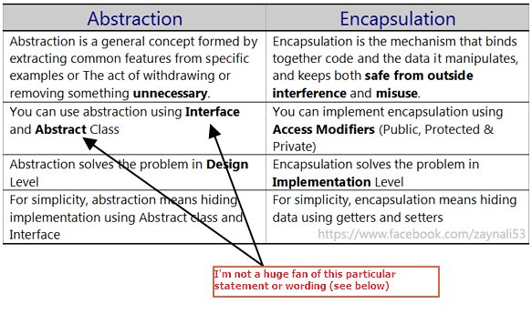

## Imperative Programming (অনুজ্ঞাসূচক, বাধ্যতামূলক)

Imperative programming consists of sets of detailed instructions that are given to the computer to execute in a given order.
We're being <b>detailed and specific in our instructions</b>, and that's what imperative programming stands for.

## Procedural Programming (পদ্ধতিগত প্রোগ্রামিং)

Procedural programming is a <b>derivation of imperative programming</b>
In procedural programming, the user is encouraged to subdivide the program execution into functions, as a way of improving modularity and organization.

## Functional Programming

it takes the concept of functions a little bit further.

1. functions are treated as first-class citizens, meaning that they can be assigned to variables, passed as arguments, and returned from other functions.
2. A pure function is one that relies only on its inputs to generate its result. it produces no side effects (any change outside the function's environment).

## Declarative Programming

1. Declarative programming is all about hiding away complexity and bringing programming languages closer to human language and thinking.
2. It's the direct opposite of imperative programming
3. doesn't give instructions about how the computer should execute the task, but rather on what result is needed.
4. JavaScript's filter, map, reduce, sort and React JSX syntax functions are good examples of declarative code.
5. JSX syntax (what React uses) mixes HTML and JS in the same thing, which makes it easier and faster to write apps. But that's not what browsers read and execute. React code is later on transpiled into regular HTML and JS, and that's what browsers run in reality.
6. An important thing to notice about declarative programming is that under the hood, the computer processes this information as imperative code anyway.

## Object-oriented programming (অবজেক্ট ভিত্তিক)

### What is OOP

An object is a
component of a program that knows how to perform certain actions and how
to interact with other elements of the program. Objects are the basic units
of object-oriented programming.

The object-oriented programming is basically a computer programming design philosophy or methodology that organizes/ models software design around data, or objects rather than functions and logic.

It simplifies <b>software development and maintenance</b> by providing major concepts such as **abstraction, inheritance, polymorphism, and encapsulation**. These core concepts support OOP.

### Points to Remember

- Everything is an object
- Developer manipulates objects that uses message passing.
- Every object is an instance of a class.
- The class contains the attribute and behavior associated with an object.

### Pillars of OOPs

The major concepts that we have discussed above are known as pillars of OOPs. There are four pillars on which OOP rests.

1. Abstraction
2. Encapsulation
3. Inheritance
4. Polymorphism

#### Abstraction (অপসারণ,প্রত্যাহরণ)

Abstraction allows us to hide the implementation from the user but shows only essential information to the user. Using the concept developer can easily make changes and added over time.


**There are the following advantages of abstraction:**

- It reduces complexity.
- It avoids delicacy.
- Eases the burden of maintenance
- Increase security and confidentially.

#### Encapsulation

Encapsulation is a mechanism that allows us to bind data and functions of a class into an entity. It protects data and functions from outside interference and misuse. Therefore, it also provides security. A class is the best example of encapsulation.

The meaning of Encapsulation, is to make sure that "sensitive" data is hidden from users.

To achieve this, you must :

1. declare class variables/attributes as private
2. provide public get and set methods to access and update the value of a private variable

**Different between Abstraction and Encapsulation**
Abstraction is the method of hiding the unwanted information. Whereas encapsulation is a method to hide the data in a single entity or unit along with a method to protect information from outside.

- Encapsulation hides internal working
- Abstraction hides details at the design level
- Encapsulation hides details at the implementation level.


## OOP In Javascript

### Factory Function

```js
const circle = {
  radius: 4,
  draw() {
    console.log("Draw");
  },
};

const circle2 = {
  radius: 4,
  draw() {
    console.log("Draw");
  },
};
// if the object has one or more object , it's call "Behavior"
// Factory Function : The Factory Function is similar to constructor functions/class functions, but instead of using new to create an object, factory functions simply creates an object and returns it. Factory Functions are a very useful tool in JavaScript

function createCircle(radius) {
  return {
    radius,
    draw() {
      console.log("Draw");
    },
  };
}
```

### Constructor Function

```js
// Constructor Function
function Circle(radius) {
  //   console.log(this);
  this.radius = radius;
  this.draw = () => {
    console.log("Draw");
  };
}

// Circle.call({}, 5);  it's only return an object if return this from the Constructor function
// Circle.apply({}, 5); it's only return an object if return this from the Constructor function
// Circle.bind({}, 5); it's only return an object if return this from the Constructor function
const circle = new Circle(5); // new keyword make an empty object {}
console.log(circle);
```

Abstraction in javascript

```js
function Circle() {
  let _ratio = { x: 0, y: 0.5 };
  this.getRatio = () => {
    return _ratio;
  };
  this.setRatio = (value) => {
    return (_ratio = value);
  };
}

const circle = new Circle();
console.log(circle.getRatio());

// Abstraction with define property
function Circle() {
  let _ratio = { x: 0, y: 0.5 };

  Object.defineProperty(this, "getRatio", {
    get() {
      return _ratio;
    },
    set(value) {
      return (_ratio = value);
    },
  });
}

const circle = new Circle();
console.log(circle.getRatio);
console.log((circle.getRatio = { x: 10, y: 2 }));
```

### Prototypes (Parent)

**What is prototype and prototype inheritance in JavaScript?**
In JavaScript, an object can inherit properties of another object. The object from where the properties are inherited is called the prototype. In short, objects can inherit properties from other objects — the prototypes

**Inheritance parent class are called by (Parent Class/Base Class/Supper Class)**
Every Object in javascript has (parent object / prototype) except the root object.and every object inherit from its prototype
We have two types of inheritance

1. Classical Inheritance
2. Prototypical Inheritance


Every Object are create from the same (object base / prototype)

```js
const x = {};
const y = {};

const result = Object.getPrototypeOf(x) === Object.getPrototypeOf(y);
console.log(result); // true; Because x and y are create from same object base
```

**Property Descriptor : see the state of a property**

```js
const obj = { name: "Rasel" };
const objectBase = Object.getPrototypeOf(obj);
// const propertyDescriptor = Object.getOwnPropertyDescriptor(
//   obj,
//   "name"
// );
const propertyDescriptor = Object.getOwnPropertyDescriptor(
  objectBase,
  "toString"
);
console.log(propertyDescriptor);
// {
// writable: true, // we can modify
// enumerable: false, // we can access parent property if true. Object.keys() will be empty if its false
// configurable: true, // we can delete if true
// value: ƒ
// }
```

**MOdify the state of a object property**

```js
const obj = { name: "Rasel", age: 30 };

// Object.defineProperty(obj, "name", {
//   enumerable: false,
// });
Object.defineProperties(obj, {
  name: {
    enumerable: false,
    writable: true,
  },
  age: {
    enumerable: false,
  },
});
console.log(Object.keys(obj)); // []
```

#### Prototype member VS Instance member

You can modify or add new prototype member . but don't do this always. because you might need to use a third party library and they may be used the same property. then it's can be destroy your application

But you can put method as an optimization technique.
so if you work a large number of object. you don't need to copy same method as instance multiple time. cause it's not good for optimize

```js
function Circle(radius) {
  // Instance Member
  this.radius = radius;
}

// Prototypical member
Circle.prototype.draw = () => {
  console.log("Draw", this.radius);
};

Circle.prototype.toString = function () {
  return "Update To String Method";
};

const c1 = new Circle();
console.log(c1);
```

#### Iterate throw Instance and Prototype Member

```js
function Circle(radius) {
  // Instance Member
  this.radius = radius;
}

// Prototypical member
Circle.prototype.draw = () => {
  console.log("Draw", this.radius);
};

Circle.prototype.toString = function () {
  return "Update To String Method";
};

const c1 = new Circle();

const keys = Object.keys(c1); // Object.keys only returns Instance/Own Member
console.log(c1.hasOwnProperty("draw")); // false

// for in loop can iterate th row instance and prototype member
for (key in c1) {
  console.log(key);
}
console.log("draw" in c1);
```

## EVENT DRIVEN PROGRAMMING

In computer programming, event-driven programming is a programming paradigm
in which the flow of the program is determined by events such as user actions
(mouse clicks, key presses), sensor outputs, or message passing from other
programs or threads
